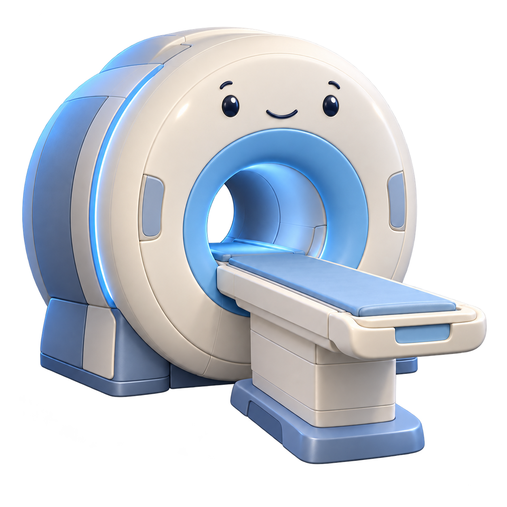
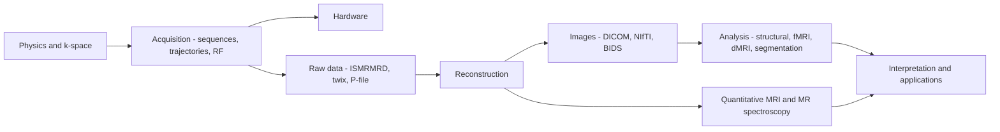

<div align="center" id="top">

<picture>
  <source media="(prefers-color-scheme: dark)" srcset="assets/wordmark-dark.png">
  
</picture>
&nbsp;&nbsp;


<br>

**A curated, verified knowledge hub for MRI research — built for AI agents.**

[](https://github.com/KeWang0622/mri-research-skill/actions/workflows/validate.yml) [](LICENSE)   [](https://github.com/KeWang0622/mri-research-skill)

</div>

---

<p align="center">
| <a href="#install"><b>Install</b></a> | <a href="#the-expert-team"><b>Agents</b></a> | <a href="#whats-inside"><b>References</b></a> | <a href="CONTRIBUTING.md"><b>Contribute</b></a> | <a href="#citation"><b>Cite</b></a> |
</p>

<p align="center">
One command makes any coding agent — Claude Code, Codex, Cursor, and 20+ more —
fluent in magnetic resonance imaging, from k-space to publication.
</p>

## Interactive tutorial

Explore MRI research with AI agents through a 24-slide presentation with interactive MRI examples.

**[View the interactive slides](https://kewang0622.github.io/slides/mri-research/)** · [Presentation information](presentations/README.md)

## News

- **[v0.7.0]** Second verified review round: **BART moved to Codeberg** (the GitHub repo is archived), the `ecalib` two-map trap is fixed, g-factor/SNR reporting is now required, and CI watches upstreams for archival. ([release](https://github.com/KeWang0622/mri-research-skill/releases/tag/v0.7.0))
- **[v0.6.0]** More sequence-design and hardware/RF tooling; a multi-agent red-team pass; branch protection + hardened CI. ([release](https://github.com/KeWang0622/mri-research-skill/releases/tag/v0.6.0))
- **[v0.5.0]** End-to-end **research-workflow** agent — idea → experiments → paper (CVPR / MICCAI / MRM). ([release](https://github.com/KeWang0622/mri-research-skill/releases/tag/v0.5.0))
- **[v0.4.0]** Split into a **7-skill multi-agent team**; the reconstruction agent runs BART/SigPy. ([release](https://github.com/KeWang0622/mri-research-skill/releases/tag/v0.4.0))
- **[v0.2.0]** Broadened from reconstruction into a **general-MRI** hub; `npx skills` distribution. ([release](https://github.com/KeWang0622/mri-research-skill/releases/tag/v0.2.0))

Full history in the [CHANGELOG](CHANGELOG.md).

## About

**mri-research** packages the sprawling MRI research landscape — physics, papers,
toolboxes, data formats, courses, and hardware — into a form an AI agent can use
directly. Install it once and your agent starts already fluent: it knows the
canonical reference, which tool fits a task, how vendor raw data differs, and how
to run a reconstruction — pointing to primary sources rather than bundling them.



**Your agent gets:**

- **Orientation across the whole pipeline** — physics & k-space, acquisition,
  reconstruction, analysis, quantitative MRI, spectroscopy, hardware, and publishing.
- **A team of expert agents** — focused skills for reconstruction, diffusion,
  sequence design, deep-learning recon, and hardware, plus an end-to-end
  research-workflow agent.
- **Actionable tools** — e.g. *"reconstruct this Cartesian k-space with BART"*
  runs a real ESPIRiT + PI/CS pipeline (bundled script).
- **268 verified pointers** — 218 links (136 code repositories) plus 50 papers
  cited by DOI or arXiv id. Each was checked against the source when written, and
  CI re-checks links on every change and weekly, so dead ends surface fast.

**Built for researchers:**

- Points to the community's primary papers, courses, handbooks, datasets, and
  toolboxes — and credits them; it bundles no datasets or copyrighted text.
- Respects dataset data-use agreements and keeps clinical reading non-diagnostic.
- Agent-agnostic: the same skills work across every agent the `skills` CLI supports.

**Tool setup is part of the work:** agents check/install the required official applications, run an upstream example, and reuse established scientific implementations. See the [application setup guide](skills/mri-research/references/tool-setup.md).

**Learn from project experience:** keep a private `.mri-research/` notebook of experiments, verified lessons and researcher preferences. The [project memory workflow](skills/mri-research/references/project-memory.md) connects it to Claude Code, Codex and other agents without changing global instructions.

## Install

Using the open [`skills`](https://github.com/vercel-labs/skills) CLI — works
across Claude Code, Codex, Cursor, OpenCode, and many more:

```bash
npx skills add KeWang0622/mri-research-skill -g      # -g = install for all your projects
```

You'll be asked which skills and which agents to install — the repo ships a
**team of skills** (a generalist hub + focused experts), so take one, several, or
all. Browse them first at
[skills.sh/KeWang0622/mri-research-skill](https://skills.sh/KeWang0622/mri-research-skill).

<details>
<summary>More install options</summary>

```bash
# Project-local instead of global: just drop -g
npx skills add KeWang0622/mri-research-skill

# Just one expert (e.g. the actionable reconstruction agent)
npx skills add KeWang0622/mri-research-skill --skill mri-reconstruction

# Every skill, for every agent detected, no prompts
#   (--all is shorthand for --skill '*' --agent '*' -y)
npx skills add KeWang0622/mri-research-skill --all

# Target a specific agent, or list the skills without installing
npx skills add KeWang0622/mri-research-skill -a claude-code
npx skills add KeWang0622/mri-research-skill --list

# Pull a new release later
npx skills update mri-research
```

No dependencies — the skills are Markdown. Or clone `skills/mri-research/` into
your agent's skills directory (e.g. `~/.claude/skills/`).
</details>

## The expert team

Each agent is an installable skill a coding agent invokes when the task fits.

| Agent | Skill | What it does |
|---|---|---|
| Generalist hub | [`mri-research`](skills/mri-research/SKILL.md) | Navigator + curated reference across the whole pipeline |
| Research workflow | [`mri-research-workflow`](skills/mri-research-workflow/SKILL.md) | **End-to-end**: idea → experiments → analysis → paper (CVPR / MICCAI / MRM) |
| Reconstruction | [`mri-reconstruction`](skills/mri-reconstruction/SKILL.md) | **Runs** ESPIRiT + PI/CS reconstruction with BART/SigPy on your k-space |
| Diffusion MRI | [`diffusion-mri`](skills/diffusion-mri/SKILL.md) | DTI/DKI/NODDI, preprocessing (topup/eddy), tractography (MRtrix3, DIPY) |
| Sequence design | [`pulse-sequence-design`](skills/pulse-sequence-design/SKILL.md) | Pulseq/PyPulseq + Siemens/GE/Philips dev, RF, SMS, GIRF, simulators |
| DL reconstruction | [`deep-learning-recon`](skills/deep-learning-recon/SKILL.md) | Unrolled / self-supervised / diffusion recon; DIRECT, fastMRI |
| Hardware | [`mri-hardware`](skills/mri-hardware/SKILL.md) | Low-field, open consoles (MaRCoS/OCRA), coils, gradients, MR safety |

## What's inside

The hub ([`SKILL.md`](skills/mri-research/SKILL.md)) routes each question to one
of eleven reference files — click any to read it:

| Stage | Reference | Covers |
|---|---|---|
| [Foundations](skills/mri-research/references/foundations.md) | [`foundations.md`](skills/mri-research/references/foundations.md) | MR physics / k-space and where to learn — Berkeley EE225E, Stanford EE369B/C, Hornak, MRIquestions, ISMRM, handbooks |
| [Acquisition](skills/mri-research/references/sequences-and-trajectories.md) | [`sequences-and-trajectories.md`](skills/mri-research/references/sequences-and-trajectories.md) | Pulseq/PyPulseq, vendor SDKs, trajectory & RF design, SMS, field mapping, GIRF, simulation |
| [Hardware](skills/mri-research/references/hardware.md) | [`hardware.md`](skills/mri-research/references/hardware.md) | Low-field, open consoles, coil/shim design (CoilGen, MARIE, Shimming Toolbox), MR safety |
| [Reconstruction](skills/mri-research/references/recon-methods.md) | [`recon-methods.md`](skills/mri-research/references/recon-methods.md) | Landmark-paper reading list: parallel imaging, CS, low-rank, DL, diffusion, MRF, GRASP, metrics |
| [Recon tools](skills/mri-research/references/tools.md) | [`tools.md`](skills/mri-research/references/tools.md) | BART (now on Codeberg), SigPy, MIRT.jl, MRIReco.jl, torchkbnufft, mri-nufft, DIRECT, ATOMMIC, Gadgetron |
| [Data](skills/mri-research/references/data-and-formats.md) | [`data-and-formats.md`](skills/mri-research/references/data-and-formats.md) | ISMRMRD & vendor raw (twix/P-file/Philips), DICOM/NIfTI/BIDS, open datasets |
| [Analysis](skills/mri-research/references/analysis-processing.md) | [`analysis-processing.md`](skills/mri-research/references/analysis-processing.md) | Structural, fMRI, dMRI, segmentation, cardiac/body/MSK, radiomics — FreeSurfer, FSL, fMRIPrep, nnU-Net |
| [Quantitative](skills/mri-research/references/quantitative-and-spectroscopy.md) | [`quantitative-and-spectroscopy.md`](skills/mri-research/references/quantitative-and-spectroscopy.md) | Relaxometry, QSM, perfusion/ASL, MT, Dixon/CEST, and MR spectroscopy |
| [Literature](skills/mri-research/references/literature-access.md) | [`literature-access.md`](skills/mri-research/references/literature-access.md) | APIs, API keys, and paper-search MCP servers (arXiv, PubMed, Semantic Scholar, OpenAlex) |
| [Publishing](skills/mri-research/references/publishing.md) | [`publishing.md`](skills/mri-research/references/publishing.md) | MR journals + author guidelines, LaTeX templates, reporting standards, abstracts |
| [Interpretation](skills/mri-research/references/radiology-primer.md) | [`radiology-primer.md`](skills/mri-research/references/radiology-primer.md) | How MR contrast reads (T1/T2/FLAIR/DWI) — background orientation only |

## Example prompts

- *"I want to run reconstruction experiments and publish in MRM (or CVPR) — help me plan the study, run baselines, analyze results, and draft the paper."*
- *"I have 8-channel knee k-space undersampled 4×. Walk me through a PI+CS reconstruction with BART."*
- *"What's the canonical paper for ESPIRiT, and how does it differ from SENSE and GRAPPA?"*
- *"I was handed a `meas.dat` file — what is it and how do I reconstruct it in Python?"*
- *"Design a golden-angle radial gradient-echo sequence in PyPulseq and simulate it first."*
- *"Preprocess this task-fMRI dataset and run a first-level GLM — what pipeline should I use?"*

<details>
<summary>What a session actually looks like</summary>

> **You:** I have `knee.cfl` — 8-channel, undersampled 4×. Reconstruct it.
>
> **Agent** *(with `mri-reconstruction` installed)*:
> ```
> $ bart show -m knee          # 320 320 1 8 — coils on dim 3, good
> $ bart ecalib -m1 -r 24 knee sens
> $ bart pics -l1 -r 0.01 knee sens img
> ```
> Used `-m1` because `ecalib` returns **two** ESPIRiT map sets by default, which
> would have left you a size-2 MAPS dimension instead of an image. ESPIRiT needs
> the fully-sampled ACS at k-space centre — your header has it.
>
> At R=4 this costs SNR as `g·√R`, so quote a g-factor, not just R: `g` is
> analytic for SENSE but not for this L1 reconstruction, so use a pseudo-replica
> estimate (Robson 2008). Raise `-r` if aliasing remains; lower it if the image
> looks over-smoothed. Method background: ESPIRiT, Uecker 2014,
> doi:10.1002/mrm.24751.

The point isn't the commands — it's that the caveats (`-m1`, the ACS assumption,
the SNR cost, the citation) arrive unprompted.
</details>

## Design principles

- **Point, don't vendor.** Link and summarize; never bundle datasets or copyrighted text.
- **Primary sources first.** Cite the original paper/repo; use awesome-lists as living indexes.
- **Decide, don't just enumerate.** Reference files help you choose the right method/tool.
- **Verify load-bearing links.** Links rot and upstreams get archived. CI
  link-checks the Markdown on every change and weekly, and flags linked repos that
  have been archived, renamed, or moved.

## Scope & disclaimers

- **Image reading is orientation, not diagnosis.** The reading primer helps
  follow research conversations about contrast; it is not clinical advice.
- **Respect dataset licenses.** fastMRI, HCP, UK Biobank, ADNI, OASIS, and BraTS
  require registration or a data-use agreement; this never helps bypass a gate.
- **Links can rot.** Every link was verified at release and is re-checked in CI.
  A few hosts bot-block link checkers (and three are excluded via
  `.lycheeignore`), so CI catches most rot, not all of it — if a link is
  load-bearing for your next step, confirm it resolves.

## Contributing

Issues and PRs are welcome — see [`CONTRIBUTING.md`](CONTRIBUTING.md). `main` is
branch-protected: contributions land via a PR that passes CI (structure,
ShellCheck, and link-checking) and review. By participating you agree to our
[Code of Conduct](CODE_OF_CONDUCT.md); report vulnerabilities via [SECURITY.md](SECURITY.md).

## Citation

If this helps your research or tooling, please cite it (GitHub's
"Cite this repository" button reads [`CITATION.cff`](CITATION.cff)):

```bibtex
@software{wang_mri_research,
  author  = {Wang, Ke},
  title   = {mri-research: A curated knowledge hub for MRI research},
  year    = {2026},
  version = {0.7.0},
  url     = {https://github.com/KeWang0622/mri-research-skill}
}
```

## Acknowledgements

Built **on top of, and in credit to,** the open MRI community — the Lustig (UC
Berkeley) and Pauly/Nishimura (Stanford) lineage; the BART, SigPy, ISMRMRD,
Gadgetron, and Pulseq ecosystems; the FreeSurfer / FSL / SPM / AFNI / ANTs and
nipreps communities; the fastMRI, mridata.org, HCP, and OpenNeuro dataset
efforts; the [ISMRM](https://www.ismrm.org); and the maintainers of the
community awesome-lists. All primary work belongs to its respective authors.
Distribution uses the open [`skills`](https://github.com/vercel-labs/skills) CLI.

## License

Released under the [MIT License](LICENSE). External resources this hub links to
(papers, datasets, software) are governed by their own licenses and terms.

<div align="center"><sub><a href="#top">↑ back to top</a> · ⭐ a star helps other researchers find this</sub></div>
