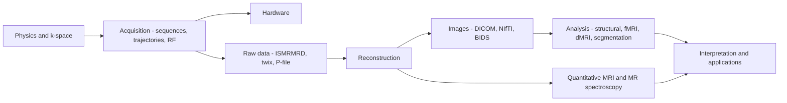

<h1 align="center">MRI Research</h1>

<p align="center">
  <strong>A curated, verified knowledge hub for magnetic resonance imaging research — built for AI agents.</strong><br>
  Physics · acquisition · reconstruction · analysis · quantitative MRI · spectroscopy · hardware.<br>
  One command makes any AI agent fluent in MRI — so the field's knowledge is open to everyone.
</p>

<p align="center">
  <a href="https://github.com/KeWang0622/mri-research-skill/blob/main/LICENSE"></a>
  
  
  <a href="https://github.com/KeWang0622/mri-research-skill/stargazers"></a>
</p>

---

## Install

Using the open [`skills`](https://github.com/vercel-labs/skills) CLI — works across Claude Code, Codex, Cursor, OpenCode, and many more agents:

```bash
npx skills add KeWang0622/mri-research-skill
```

<details>
<summary>More install options</summary>

```bash
# Install globally (user directory) instead of the current project
npx skills add KeWang0622/mri-research-skill -g

# Target a specific agent
npx skills add KeWang0622/mri-research-skill -a claude-code

# List what's in the repo without installing
npx skills add KeWang0622/mri-research-skill --list

# Try it without installing — pipe a generated prompt straight into an agent
npx skills use KeWang0622/mri-research-skill | claude
```

Or add it manually by copying `skills/mri-research/` into your agent's skills
directory (e.g., `~/.claude/skills/`). No dependencies — it's Markdown.
</details>

## What it is

A fluent, well-oriented guide to the **whole MRI pipeline** — from spins to
statistics. It's a **pointer / reference** hub, not a data dump: MRI datasets
run from hundreds of GB to multiple TB and sit behind data-use agreements, and
textbooks are copyrighted, so it teaches *where the authoritative resources
live* and *which tool fits a given task*, then links out to the community's own
repositories, papers, courses, and datasets.

Once installed, your agent can immediately reason about k-space, pick the right
reconstruction method and toolbox, tell Siemens *twix* from a GE *P-file*,
preprocess an fMRI dataset with fMRIPrep, or point you to the canonical paper,
course, handbook, or dataset — with verified links.

It builds **on top of, and in credit to,** the open MRI community.

## Why it exists

Built for **AI agents**. MRI expertise is scattered — across papers, course
notes, vendor manuals, and dozens of toolboxes — which makes it slow even for
experts and daunting for newcomers. This packages that landscape into a form an
agent can use directly, so any researcher's agent starts already fluent in MRI.

The goal is simple: **make the MRI community's collective knowledge accessible
to everyone**, through whatever AI agent they already use — an open,
community-maintained starting point rather than know-how locked inside
individual labs.

## The MRI pipeline it maps



## What's inside

The navigator (`skills/mri-research/SKILL.md`) holds a core MR mental model and
routes each question to one of ten reference files:

| Stage | File | Covers |
|---|---|---|
| Foundations | `foundations.md` | MR physics / k-space and where to learn — Berkeley EE225E, Stanford EE369B/C, Hornak, MRIquestions, ISMRM, and the canonical handbooks/textbooks |
| Acquisition | `sequences-and-trajectories.md` | Pulse-sequence programming (Pulseq/PyPulseq, vendor SDKs), trajectory design, RF pulse design, simulation (KomaMRI) |
| Hardware | `hardware.md` | Low-field, open-source consoles (OSI², MaRCoS, OCRA), coils, gradients, safety |
| Reconstruction | `recon-methods.md` | Landmark-paper reading list: parallel imaging, compressed sensing, low-rank, deep learning, diffusion/score-based, MR fingerprinting |
| Recon tools | `tools.md` | BART, SigPy, MIRT.jl, MRIReco.jl, torchkbnufft, gpuNUFFT, mri-nufft, DIRECT, fastMRI, Gadgetron |
| Data | `data-and-formats.md` | ISMRMRD & vendor raw (twix/P-file/Philips), DICOM/NIfTI/BIDS, and open datasets |
| Analysis | `analysis-processing.md` | Structural, functional, and diffusion MRI; segmentation & registration — FreeSurfer, FSL, SPM, AFNI, ANTs, fMRIPrep, MRtrix3, DIPY, nnU-Net, MONAI |
| Quantitative | `quantitative-and-spectroscopy.md` | Relaxometry, QSM, perfusion/ASL, MT, and MR spectroscopy (LCModel, Osprey, FSL-MRS) |
| Literature | `literature-access.md` | APIs, API keys, and paper-search MCP servers (arXiv, PubMed, Semantic Scholar, OpenAlex, Crossref) |
| Publishing | `publishing.md` | MR journals + author guidelines, LaTeX templates, reporting/reproducibility standards, abstracts, preprints |
| Interpretation | `radiology-primer.md` | How MR contrast reads (T1/T2/FLAIR/DWI) — background orientation only |

## Example prompts

- *"I have 8-channel knee k-space undersampled 4×. Walk me through a PI+CS reconstruction with BART."*
- *"What's the canonical paper for ESPIRiT, and how does it differ from SENSE and GRAPPA?"*
- *"I was handed a `meas.dat` file — what is it and how do I reconstruct it in Python?"*
- *"Design a golden-angle radial gradient-echo sequence in PyPulseq and simulate it first."*
- *"Preprocess this task-fMRI dataset and run a first-level GLM — what pipeline should I use?"*
- *"Which open dataset should I benchmark a cardiac cine reconstruction on, and what are the access terms?"*
- *"Summarize the state of diffusion-model MRI reconstruction and point me to codebases."*

## Design principles

- **Point, don't vendor.** Link and summarize; never bundle datasets or copyrighted text.
- **Primary sources first.** Cite the original paper/repo; use awesome-lists as living indexes.
- **Decide, don't just enumerate.** Reference files help you choose the right method/tool.
- **Verify load-bearing links.** Links rot; confirm a link before acting on it.

## Scope & disclaimers

- **Image reading is orientation, not diagnosis.** The reading primer helps
  follow research conversations about contrast; it is not clinical or diagnostic
  advice. Interpretation of real scans belongs to a qualified radiologist.
- **Respect dataset licenses.** Many datasets (fastMRI, HCP, UK Biobank, ADNI,
  OASIS, BraTS) require registration or a data-use agreement; this never helps
  circumvent an access gate.
- **Links can rot.** Every link was verified at release, but repositories move
  and course pages change.

## Contributing

Issues and PRs are welcome — see [`CONTRIBUTING.md`](CONTRIBUTING.md). The one
firm rule: preserve the pointer-not-dump philosophy and verify every link and
citation you add.

## Citing

If this helps your research or tooling, please cite it via the
[`CITATION.cff`](CITATION.cff) metadata (GitHub's "Cite this repository" button
formats it for you).

## Acknowledgements

Built **on top of, and in credit to,** the open MRI community — among them the
Lustig group (UC Berkeley) and the Pauly/Nishimura lineage (Stanford); the BART,
SigPy, ISMRMRD, Gadgetron, and Pulseq ecosystems; the FreeSurfer/FSL/SPM/AFNI/
ANTs and nipreps analysis communities; the fastMRI, mridata.org, HCP, OpenNeuro,
and other dataset efforts; the [ISMRM](https://www.ismrm.org); and the
maintainers of the community awesome-lists. All primary work belongs to its
respective authors. Distribution uses the open [`skills`](https://github.com/vercel-labs/skills) CLI.

## License

Released under the [MIT License](LICENSE). External resources this hub links to
(papers, datasets, software) are governed by their own licenses and terms.
