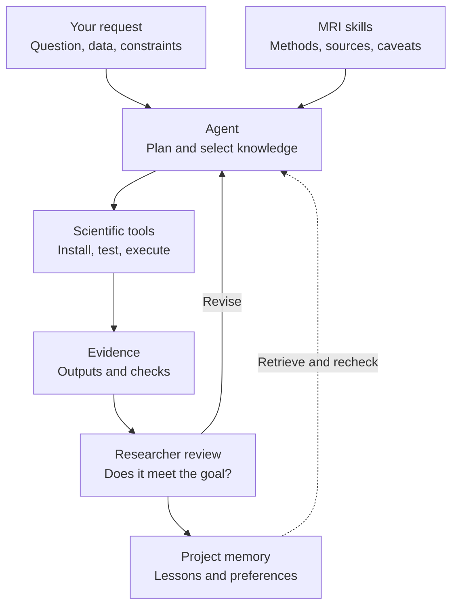

<div align="center" id="top">

<picture>
  <source media="(prefers-color-scheme: dark)" srcset="assets/wordmark-dark.png">
  
</picture>
&nbsp;&nbsp;


<br>

**MRI research guidance for your coding agent — from the question to the paper.**

[](https://github.com/KeWang0622/mri-research-skill/actions/workflows/validate.yml) [](LICENSE)   [](https://github.com/KeWang0622/mri-research-skill)

</div>

<p align="center">
<a href="#quick-start">Quick start</a> · <a href="#how-it-works">Workflow</a> · <a href="#choose-your-skills">Skills</a> · <a href="#research-memory">Research memory</a> · <a href="https://kewang0622.github.io/slides/mri-research/">Interactive tutorial</a> · <a href="#contributing">Contribute</a>
</p>

Coding agents can write MRI code, but choosing the right signal model, data convention, tool and validation takes domain knowledge. **mri-research** gives your agent curated guidance and primary references across MRI physics, acquisition, reconstruction, analysis and publishing.

**Seven installable skills · Established scientific tools · Project-local research memory**

## Quick start

Install with the open [skills CLI](https://github.com/vercel-labs/skills), then select the skills and supported coding agents you want to use:

```bash
npx skills add KeWang0622/mri-research-skill -g
```

Start with a request in your agent:

> Design a golden-angle radial gradient-echo in PyPulseq and simulate it first. Then reconstruct the simulated data and check whether the image meets the research goal.

The skills guide tool selection, setup, execution and checks. Scientific applications such as PyPulseq, KomaMRI and BART are installed separately as needed; the agent is instructed to handle routine setup in an isolated environment and test an upstream example before use.

**[Explore the interactive tutorial →](https://kewang0622.github.io/slides/mri-research/)** — agents, skills, MRI examples and the self-improvement workflow. [Presentation information](presentations/README.md).

<details>
<summary>Install one skill, choose an agent, or update</summary>

```bash
# Install only for the current project
npx skills add KeWang0622/mri-research-skill

# Choose one skill
npx skills add KeWang0622/mri-research-skill --skill mri-reconstruction

# Target a supported agent
npx skills add KeWang0622/mri-research-skill -a claude-code

# Browse without installing
npx skills add KeWang0622/mri-research-skill --list

# Update installed global skills
npx skills update -g
```

Choose one, several or all seven skills. Browse the [skills directory](https://skills.sh/KeWang0622/mri-research-skill). These are Markdown instructions and supporting helpers; installing them does not install every scientific application or grant access to restricted datasets.

</details>

## How it works

**You set the research goal. The agent uses skills as guidance and tools to take action.** A task may need several skills; the seven skills are not seven separate models.



Tools include **PyPulseq** for sequence definitions, **KomaMRI** for simulation, **BART / SigPy** for reconstruction, and **MRtrix3 / DIPY** for diffusion analysis. Data resources and papers supply inputs and evidence; skills help the agent choose and use them.

### Research phases

| Phase | What the agent helps with | What to inspect |
|---|---|---|
| **1 · Frame the question** | Read primary literature, identify the gap, combine relevant skills. | A specific question, assumptions and success criteria. |
| **2 · Design the study** | Choose data, acquisition or simulation, baselines and metrics. | A feasible plan with controls and comparison conditions. |
| **3 · Run the work** | Set up established tools; simulate, reconstruct or analyze. | Commands, versions, outputs and failed attempts. |
| **4 · Evaluate the evidence** | Inspect images and results; test assumptions, accuracy and robustness. | Whether the result supports the claim—not just whether code ran. |
| **5 · Write and improve** | Draft figures and methods; record scoped lessons for the next task. | Traceable claims, limitations and reusable project knowledge. |

These phases are iterative. New evidence or user feedback can send the work back to an earlier decision. The [research-workflow skill](skills/mri-research-workflow/SKILL.md) connects the phases; specialist skills supply the domain guidance.

## Choose your skills

Start with **mri-research** for orientation, **mri-research-workflow** for a study, or a specialist for a focused task.

| Skill | Use it for | Typical tools or resources |
|---|---|---|
| [MRI research](skills/mri-research/SKILL.md) | Physics, references, cross-domain questions and image-level analysis | Courses, papers, BIDS, FSL, FreeSurfer |
| [Research workflow](skills/mri-research-workflow/SKILL.md) | Question → study design → experiments → manuscript | Literature, baselines, metrics, venue guidance |
| [Reconstruction](skills/mri-reconstruction/SKILL.md) | Raw k-space, coil maps, parallel imaging, compressed sensing, non-Cartesian recon | BART, SigPy, ISMRMRD |
| [Sequence design](skills/pulse-sequence-design/SKILL.md) | RF/gradient events, trajectories, timing and simulation | Pulseq/PyPulseq, KomaMRI, vendor references |
| [Deep-learning reconstruction](skills/deep-learning-recon/SKILL.md) | Trained, unrolled, self-supervised and diffusion-based recon | DIRECT, ATOMMIC, fastMRI |
| [Diffusion MRI](skills/diffusion-mri/SKILL.md) | DWI preprocessing, models, fiber orientations and tractography | MRtrix3, DIPY, FSL, QSIPrep |
| [Hardware](skills/mri-hardware/SKILL.md) | Coils, gradients, low-field systems, shimming and safety orientation | MaRCoS, OCRA, EM and shim tools |

## Research memory

Each project can keep a private **`.mri-research/`** notebook. The improvement loop is **retrieve → execute → evaluate → update → reuse and verify**.

```text
.mri-research/
├── INDEX.md          # Relevant work and next steps
├── preferences.md    # Your explicit research habits
├── environment.md    # Working tools, versions and setup checks
├── runs/             # Experiments, outcomes and failures
└── lessons.md        # Reusable findings with evidence and limits
```

A lesson should change a concrete decision in the next task, then be checked again. Keep user preferences separate from scientific conclusions, and retain failed or superseded findings. Project `CLAUDE.md` / `AGENTS.md` can point agents to the notebook; this is instruction-based memory, not model retraining or guaranteed automatic learning.

[Set up project memory →](skills/mri-research/references/project-memory.md) · [How agents set up scientific tools →](skills/mri-research/references/tool-setup.md)

## Try a research question

| Your request | Knowledge the agent needs to combine |
|---|---|
| “Why do my eight receive channels look different, and how can reconstruction use that?” | Coil sensitivity and hardware + reconstruction's encoding model |
| “Design a golden-angle GRE, simulate it, then reconstruct its data.” | Sequence timing + hardware constraints + Bloch simulation + non-Cartesian reconstruction |
| “Plan a reproducible MRI reconstruction study for MRM.” | Literature + data conventions + baselines + evaluation + scientific writing |
| “Could free water explain this change in diffusion metrics?” | Diffusion models + confounds + controlled experiment design |

These are example requests, not prerecorded successful runs. Results depend on the agent, tool access, data and validation.

## Reference library

The hub links to primary papers, courses, datasets and software across MRI. It summarizes when a resource is useful rather than redistributing it.

<details>
<summary>Browse the MRI reference areas</summary>

| Stage | Reference | Covers |
|---|---|---|
| [Foundations](skills/mri-research/references/foundations.md) | [`foundations.md`](skills/mri-research/references/foundations.md) | MR physics / k-space and where to learn — Berkeley EE225E, Stanford EE369B/C, Hornak, MRIquestions, ISMRM, handbooks |
| [Acquisition](skills/mri-research/references/sequences-and-trajectories.md) | [`sequences-and-trajectories.md`](skills/mri-research/references/sequences-and-trajectories.md) | Pulseq/PyPulseq, vendor SDKs, trajectory & RF design, SMS, field mapping, GIRF, simulation |
| [Hardware](skills/mri-research/references/hardware.md) | [`hardware.md`](skills/mri-research/references/hardware.md) | Low-field, open consoles, coil/shim design (CoilGen, MARIE, Shimming Toolbox), MR safety |
| [Reconstruction](skills/mri-research/references/recon-methods.md) | [`recon-methods.md`](skills/mri-research/references/recon-methods.md) | Landmark-paper reading list: parallel imaging, CS, low-rank, DL, diffusion, MRF, GRASP, metrics |
| [Recon tools](skills/mri-research/references/tools.md) | [`tools.md`](skills/mri-research/references/tools.md) | BART (now on Codeberg), SigPy, MIRT.jl, MRIReco.jl, torchkbnufft, mri-nufft, DIRECT, ATOMMIC, Gadgetron |
| [Data](skills/mri-research/references/data-and-formats.md) | [`data-and-formats.md`](skills/mri-research/references/data-and-formats.md) | ISMRMRD & vendor raw (twix/P-file/Philips), DICOM/NIfTI/BIDS, open datasets |
| [Analysis](skills/mri-research/references/analysis-processing.md) | [`analysis-processing.md`](skills/mri-research/references/analysis-processing.md) | Structural, fMRI, dMRI, segmentation, cardiac/body/MSK, radiomics — FreeSurfer, FSL, fMRIPrep, nnU-Net |
| [Quantitative](skills/mri-research/references/quantitative-and-spectroscopy.md) | [`quantitative-and-spectroscopy.md`](skills/mri-research/references/quantitative-and-spectroscopy.md) | Relaxometry, QSM, perfusion/ASL, MT, Dixon/CEST, and MR spectroscopy |
| [Literature](skills/mri-research/references/literature-access.md) | [`literature-access.md`](skills/mri-research/references/literature-access.md) | APIs, API keys, and paper-search MCP servers (arXiv, PubMed, Semantic Scholar, OpenAlex) |
| [Publishing](skills/mri-research/references/publishing.md) | [`publishing.md`](skills/mri-research/references/publishing.md) | MR journals + author guidelines, LaTeX templates, reporting standards, abstracts |
| [Interpretation](skills/mri-research/references/radiology-primer.md) | [`radiology-primer.md`](skills/mri-research/references/radiology-primer.md) | How MR contrast reads (T1/T2/FLAIR/DWI) — background orientation only |

</details>

## Reliability and scope

- **Established implementations.** Use the scientific tool's official setup and examples; do not replace missing dependencies with an improvised simulator or solver.
- **Evidence before claims.** Execution, data consistency, image quality and scientific validity need different checks. Researcher judgment remains essential.
- **Checked references.** CI checks structure, version consistency, links and upstream availability; scheduled checks flag archival and drift. Passing CI does not validate scientific conclusions, and some hosts block automated link checks.
- **Appropriate use.** Image-reading material is research orientation, not clinical diagnosis. Scanner operation needs local validation. External software and datasets retain their own licenses and access requirements.

## Contributing

Bring a correction, a useful primary reference or a workflow you have tested. A strong contribution includes **the problem, supporting evidence and the proposed change**. Share reviewed, generalizable lessons; keep personal research notebooks private unless intentionally shared.

See [CONTRIBUTING.md](CONTRIBUTING.md), [Code of Conduct](CODE_OF_CONDUCT.md) and [SECURITY.md](SECURITY.md). Contributions go through pull requests and CI.

## Updates

- **On main:** agent-owned application setup and project research memory across all seven skills.
- **[v0.7.0](https://github.com/KeWang0622/mri-research-skill/releases/tag/v0.7.0):** updated BART upstream guidance, reconstruction caveats and upstream monitoring.
- [Full changelog](CHANGELOG.md) · [Releases](https://github.com/KeWang0622/mri-research-skill/releases)

## Star history

If this is useful to your research group, a star helps others discover it.

<a href="https://www.star-history.com/?repos=KeWang0622%2Fmri-research-skill&amp;type=date">
  <picture>
    <source media="(prefers-color-scheme: dark)" srcset="https://api.star-history.com/svg?repos=KeWang0622/mri-research-skill&amp;type=Date&amp;theme=dark">
    <source media="(prefers-color-scheme: light)" srcset="https://api.star-history.com/svg?repos=KeWang0622/mri-research-skill&amp;type=Date">
    
  </picture>
</a>

Chart provided by [Star History](https://github.com/star-history/star-history); updates depend on its service and GitHub's image cache.

## Citation

If this helps your research or tooling, please cite it (GitHub's
"Cite this repository" button reads [`CITATION.cff`](CITATION.cff)):

```bibtex
@software{wang_mri_research,
  author  = {Wang, Ke},
  title   = {mri-research: A curated knowledge hub for MRI research},
  year    = {2026},
  version = {0.7.0},
  url     = {https://github.com/KeWang0622/mri-research-skill}
}
```

## Acknowledgements

Built **on top of, and in credit to,** the open MRI community — the Lustig (UC
Berkeley) and Pauly/Nishimura (Stanford) lineage; the BART, SigPy, ISMRMRD,
Gadgetron, and Pulseq ecosystems; the FreeSurfer / FSL / SPM / AFNI / ANTs and
nipreps communities; the fastMRI, mridata.org, HCP, and OpenNeuro dataset
efforts; the [ISMRM](https://www.ismrm.org); and the maintainers of the
community awesome-lists. All primary work belongs to its respective authors.
Distribution uses the open [`skills`](https://github.com/vercel-labs/skills) CLI.

## License

Released under the [MIT License](LICENSE). External resources this hub links to
(papers, datasets, software) are governed by their own licenses and terms.

<div align="center"><sub><a href="#top">↑ back to top</a></sub></div>
