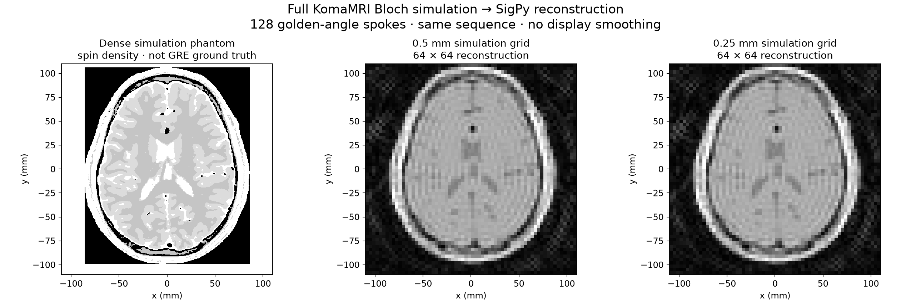

# Golden-angle GRE: a failed reconstruction, then a measured correction

This reproducible example accompanies [slide 22](https://kewang0622.github.io/slides/mri-research/#22). PyPulseq defines the acquisition, KomaMRI simulates its exported sequence, and SigPy reconstructs the resulting samples. The first attempt used an inadequate sparse phantom. The revised experiment records both failures and acceptance checks.



## Reproduce

Python 3.12 was used. From this directory:

```bash
python3 -m venv .venv
.venv/bin/python -m pip install -r requirements.lock.txt
.venv/bin/python design_sequence.py
PYTHON_JULIACALL_HANDLE_SIGNALS=yes JULIA_NUM_THREADS=2 .venv/bin/python dense/simulate_metal.py
PYTHON_JULIACALL_HANDLE_SIGNALS=yes JULIA_NUM_THREADS=2 .venv/bin/python dense/simulate_subvoxel.py
.venv/bin/python dense/validate_reconstruction.py
.venv/bin/python dense/reconstruct_dense.py
```

The GPU path uses KomaMRI's official Metal backend on Apple Silicon; its loader installs the Julia backend on first use. `simulate_dense.py` provides the CPU f64 reference at 2 mm and 1 mm. Other platforms need an upstream-supported backend and corresponding simulation configuration; the Metal workflow is not claimed portable unchanged. `JuliaProject.toml` and `JuliaManifest.toml` record the tested Julia environment. The Python interface provisions Julia; these snapshots are provenance, not automatically applied by the commands above.

The scripts generate signals and phantom arrays locally. This repository contains source, sequence and reviewed figures/reports, rather than distributing those generated arrays. Rerunning a simulation intentionally takes time. The Metal script resumes by skipping existing grid files; remove a corresponding generated file before changing its simulation settings.

## What passed—and what did not

| Check | Result |
|---|---|
| Analytic point phase/axis error | 0.000436% |
| Resolution-matched image-recovery error | 0.0137% |
| CPU f64 vs Metal f32 signal difference, 2 mm | 0.00954% |
| 2 mm → 1 mm magnitude-image change | 10.10% — fails the 5% criterion |
| 1 mm → native 0.5 mm image change | 5.48% — fails |
| Native voxel center → four subvoxel samples | 1.60% — passes scoped quadrature criterion |
| Final relative signal residual | 0.777% |

The last comparison holds the native 0.5-mm tissue map fixed, assuming constant tissue properties inside each voxel. Four subvoxel samples improve numerical quadrature; they add no anatomical detail. The earlier map-subsampling failures remain failures. The reconstruction has an explicit Fourier-disk constraint (about 3.67 mm nominal resolution), not display smoothing. The independent recovery reference uses that same bandwidth; it is not a claim to recover unmeasured sharp detail.

Through-slice convergence, dense-grid RF-step convergence, off-resonance-aware reconstruction and scanner safety remain outside the completed checks. This is a noiseless, single-receive-channel simulation prototype, not a scanner-ready or clinical protocol.

See the [detailed experiment record](dense/README.md) and [machine-readable report](dense/reconstruction_report.json). The [project research memory workflow](../../skills/mri-research/references/project-memory.md) describes how an agent can preserve failures, scoped lessons and user corrections for later work.

## Sources

[PyPulseq](https://github.com/pulseq/pypulseq), [KomaMRI](https://github.com/JuliaHealth/KomaMRI.jl), its [Python interface](https://github.com/JuliaHealth/komamripy), and [SigPy](https://github.com/mikgroup/sigpy) supply the scientific implementations. The built-in KomaMRI brain phantom derives from [BrainWeb](https://brainweb.bic.mni.mcgill.ca/brainweb/): Cocosco et al. (1997), Collins et al. (1998), Aubert-Broche et al. (2006). No patient scan was acquired for this example.
